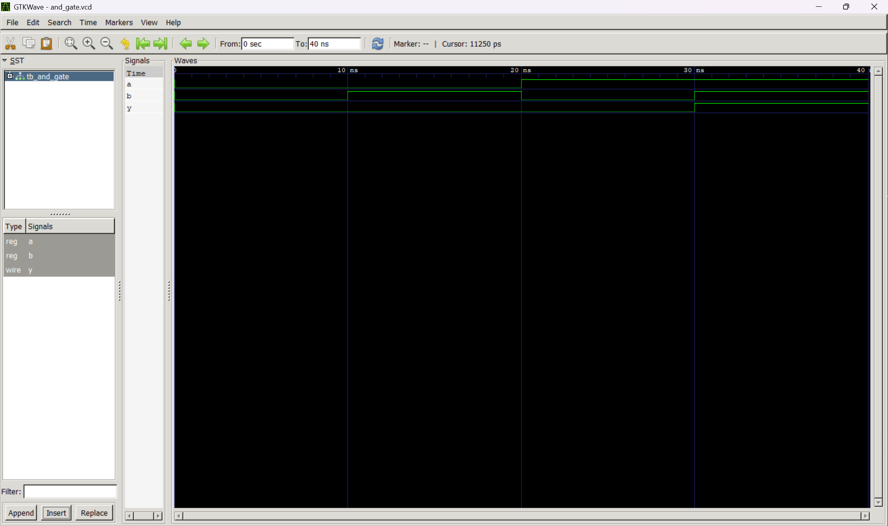

# AND Gate using Dataflow Modeling in Verilog

## Overview
This repository contains the Verilog HDL implementation of a 2-input AND gate using the **Dataflow Modeling** approach. The design demonstrates the use of a continuous assignment (`assign`) statement to implement combinational logic.

---

## Project Description
The AND gate is one of the fundamental digital logic gates. It produces a HIGH output only when both input signals are HIGH. This project implements the AND gate in Verilog HDL using dataflow modeling and verifies its functionality through simulation.

---

## Features
- 2-input AND gate implementation
- Dataflow Modeling in Verilog HDL
- Simple combinational logic design
- Testbench for functional verification
- GTKWave simulation output

---

## Inputs and Outputs

| Signal | Type | Description |
|--------|------|-------------|
| A | Input | First input |
| B | Input | Second input |
| Y | Output | AND gate output |

---

## Logic Function

```verilog
assign Y = A & B;
```

---

## Truth Table

| A | B | Y |
|:-:|:-:|:-:|
| 0 | 0 | 0 |
| 0 | 1 | 0 |
| 1 | 0 | 0 |
| 1 | 1 | 1 |

---

## File Structure

```
AND_gate/
│
├── and_gate.v
├── testbench_AND_GATE.v
├── and_gate_waveform.png
└── README.md
```

---

## Simulation Output



---

## Tools Used

- Verilog HDL
- Icarus Verilog
- GTKWave
- GitHub

---

## How to Run

1. Compile the design and testbench using Icarus Verilog.
2. Run the generated simulation executable.
3. Open the generated VCD file using GTKWave.
4. Verify the output waveform.

---

## Learning Outcome

This project demonstrates:
- Dataflow Modeling in Verilog HDL
- Continuous assignment (`assign`)
- Design of combinational logic circuits
- Functional verification using a testbench
- Waveform analysis using GTKWave

---

## Author

**Ansh Tyagi**

Integrated ECE (VLSI) Student  
Jaypee Institute of Information Technology (JIIT), Noida

---
